	TÍTULO PRÁCTICA: 
Resolución de problemas sobre JavaScript
	OBJETIVO ALCANZADO:
•	Entender y organizar de una mejor manera los sitios de web en Internet 

•	Diseñar adecuadamente elementos gráficos en sitios web en Internet. 

•	Crear sitios web aplicando estándares actuales

	ACTIVIDADES DESARROLLADAS
  
### 1.	Diseñar una interfaz en HTML que permita ingresar los siguientes campos en un formulario: cedula, nombres, apellidos, dirección, teléfono, fecha de nacimiento, correo electrónico y contraseña. Luego, usando funciones de JavaScript se pide validar que todos los campos han sido ingresados, además; que los valores ingresados en cada campo del formulario sean correctos teniendo en cuenta las siguientes condiciones:  
 
  •	Se debe validar qué, en el campo de la cedula, se ingrese sólo números y que la misma     sea correcta, en base, al último dígito verificador.
  
  Para la validación de la cédula se usó el método del último digito. En el cual se realizó   los siguientes puntos:
  
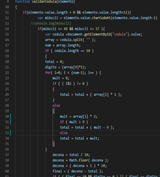</img>

  - En el primer if se valida que la cedula no sobrepase la longitud de diez números, y si sobrepasa no se permitirá ingresar más valores.

  - En el segundo if se valida que los datos ingresados sean solo números, en el caso que sean otros caracteres no se permite ingresarlos
 
 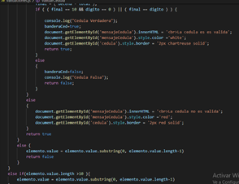</img>
 
  - Con el tercer if validamos si el campo de cedula sea igual a diez números para así      poder realizar la validación de la cedula con el ultimo digito.
  - Los else del los dos primeros if y el de la validación se encuentra los innerHTML y   los estilos para que se agregue el span, sobre la validación que tiene.

•	Se debe validar qué, en el campo del nombre, ingrese exclusivamente dos nombres y que permita ingresar sólo letras, por ejemplo: “Gabriel Alejandro”, es válido; “Gabriel”, no es válido.

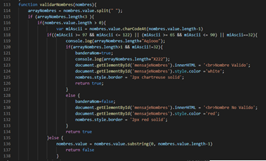</img>

  - El primer if se valida que en el input se ingrese solo dos nombres, y si sobrepasa se va borrando.
  - El segundo if se valida que el campo no este vacio para poder crear el span.
  - El tercer if se valida que el nombre contenga solo letras ya sean mayúsculas o minúsculas, también cuando se da un espacio en el campo.
 
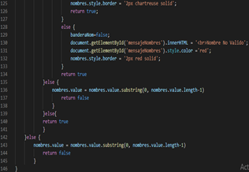</img> 
  
  - Con el cuarto if se valida que los nombres sean dos y que no contenga otro espacio después del nombre.
  - Los else nos ayuda a que no ingresen datos invalidos y también se encuentra los innerHTML y los estilos para que se agregue el span, sobre la validación que tiene 

 •	Se debe validar qué, en el campo del apellido, ingrese exclusivamente dos apellidos y que permita ingresar sólo letras, por ejemplo: “León Paredes”, es válido; “León”, no es válido. 
 
 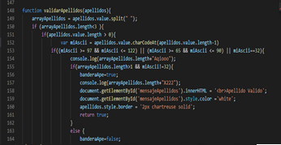</img> 
 
  - El primer if se valida que en el input se ingrese solo dos apellidos, y si sobrepasa se va borrando.
  - El segundo if se valida que el campo no este vacio para poder crear el span.
  - El tercer if se valida que el apellido contenga solo letras ya sean mayúsculas o minúsculas, también cuando se da un espacio en el campo.

 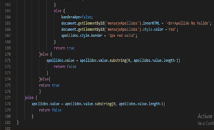</img> 
 
  - Con el cuarto if se valida que los apellidos sean dos y que no contenga otro espacio después del apellido.
  - Los else nos ayuda a que no ingresen datos invalidos y también se encuentra los innerHTML y los estilos para que se agregue el span, sobre la validación que tiene. 

 •	Se debe validar qué, en el campo del teléfono, permita ingresar sólo números y un máximo de 10 caracteres numéricos. 

 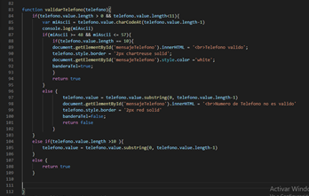</img> 
 
  - El primer if valida que la la longitud de los datos teléfono no sean mayores a diez.
  - El segundo if valida que los datos del campo teléfono sean solo números.
  - Con el tercer if realizamos la validación cuando los el campo telefono sea igual a diez los innerHTML y los estilos para que se agregue el span, sobre la validación que tiene.
  
 • Se debe validar que la fecha de nacimiento ingrese en el formato dd/mm/yyyy. 
 
 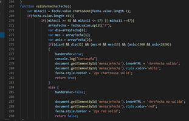</img> 
 
  - El primer if valida que los campos ingresados no sean mayores a diez.
  - El segundo if valida el carácter que se está ingresando, en caso de ser número o slash lo valida e ingresa al entonces.
 
 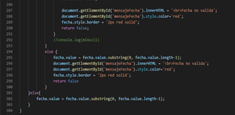</img> 
 
  - Con el tercer if validamos que el campo fecha sea ingresada correctamente, que los días no sean mayor a 31 , o que el mes no sea mayor a 12 y que el año tenga solo cuatro números.
  - Los else nos ayuda a que no ingresen datos invalidos y también se encuentra los innerHTML y los estilos para que se agregue el span, sobre la validación que tiene. 

 • Se debe validar qué, en el campo correo electrónico, permita ingresar un correo válido. Se considera un correo válido, cuando comienza por tres o más valores alfanuméricos, luego un @, seguido por la extensión “ups.edu.ec” o “est.ups.edu.ec” 
 
 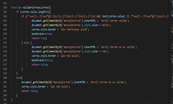</img> 
 
  - Con el siguiente código validamos que el correo sea mayor a tres antes de la arroba, también se valida que el valor del correo contenga extensiones como se solicita en la práctica. 
  - Los else nos ayuda a que no ingresen datos inválidos y también se encuentra los innerHTML y los estilos para que se agregue el span, sobre la validación que tiene. 

 • Se debe validar que la contraseña ingresada tenga mínimo 8 caracteres, además, debe incluir al menos: una letra mayúscula, una letra minúscula y un carácter especial (@, _, $) 
 
 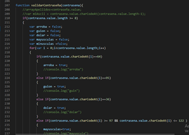</img> 
 
  - Con el primer if se valida que la longitud de la contraseña contenga el valor mayor a ocho
  - Se utiliza una bandera para que sea verdadero en caso de que se ingrese los caracteres especiales solicitados.

 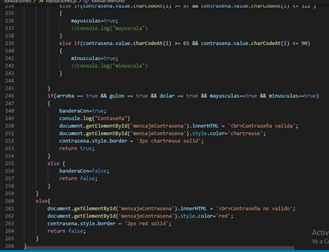</img> 
 
  - Se utiliza un for para recorrer todo el campo de la contraseña y validar los campos que se ingresaron.
  - Los else nos ayuda a que no ingresen datos inválidos y también se encuentra los innerHTML y los estilos para que se agregue el span, sobre la validación que tiene. 

### 2.	Diseñar una interfaz en html que tenga tres botones que diga “Anterior”, “Iniciar”, “Siguiente”, y una imagen. Luego, desde javascript se debe controlar para al hacer clic sobre uno de los botones realice una acción relacionada a una galería de imágenes (ver ejemplo, https://gihp4c.blog.ups.edu.ec/)

 • Creación de arreglo con los nombres de diez imágenes y almacenas en la carperta Imágenes. 
 
 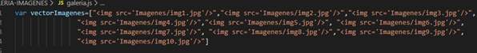</img> 
 
 • La galería de imágenes debe visualizar exclusivamente 5 imágenes 
 
 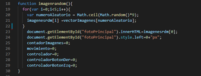</img> 
 
  - En la siguiente función guardamos solamente cinco imágenes en un arreglo que se va ah usar posteriormente.

 • Cada vez que se haga clic en el botón iniciar se deben escoger de manera aleatoria cinco imágenes de las diez que se mostrarán en la galería de imágenes. 
 
 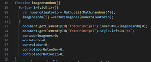</img> 
 
  - Al igual que en el anterior punto la función nos ayuda a escoger cinco imágenes de manera aleatoria.
 
 • Al hacer clic en el botón siguiente o anterior se debe cambiar la imagen presentada en la galería
 
 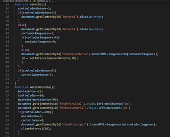</img> 
 
  - Con las siguientes funciones validaremos las posiciones que toma cada imagen del vector, al igual con la imagen que será la siguiente. Tambien se hata un intervalo de tiempo que llame al método cada cierto tiempo con el cual nos ayudara a mover la imagen.
 
 • El cambio de imágenes debe simular un efecto, para lo cuál, se debe usar las propiedades left o rigth.
 
 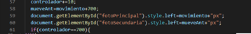</img>  
 
 • Al hacer clic en el botón siguiente y haber llegado a la última imagen disponible, el botón siguiente deberá ser deshabilitado (sólo cuando se ha llegado a la última imagen el botón siguiente deberá estar deshabilitado)
 
 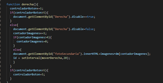</img> 
 
  - Con la funcion derecha o izquierda validaremos un contador para que se indique el valor que toma para saber si el botón se debe deshabilitar o habilitar.
  
### 3.	Realizar una calculara en HTML usando botones de javascript y una caja de texto para visualizar el resultado. Las operaciones que podrá hacer la calculadora son: suma, resta, multiplicación y división. Además, se podrá limpiar la memoria de la calculadora. Por último, se debe usar la función eval() para realizar las operaciones aritméticas  
 
 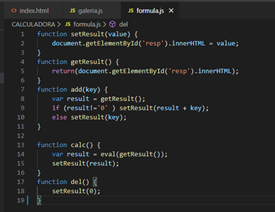</img> 
 
### 4.	Validaciones de las páginas.
#### Pagina de Validación de Formularios
 - Validación con datos Incorrectos 
 
 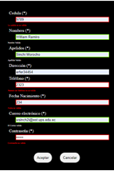</img>  
 
 - Validación con datos Correctos
 
  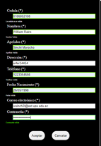</img>
  
 #### Página de Validación de la Galeria
  - Transicion de las Imágenes luego de presionar los botones.
  
  </img>
  
 #### Página de Validación de la Calculadora
  - Operación de la Calculadora
  
  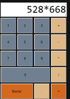</img>
  
  - Resultado de la Calculadora
  
  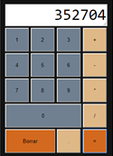</img>
  
### CONCLUSIONES:

Se pudo realizar con éxito funciones como validar campos de un formulario, en los cuales se los hace en tiempo real llamando a la función, también realizar las codificaciones para saber que tipo de caracteres se están ingresando, pueden ser los numéricos, caracteres alfabéticos y caracteres especiales.
Se realizo animaciones con imágenes, en este caso puntual la transición de imágenes, además del uso de botones para el movimiento requerido.

### RECOMENDACIONES:
Para realizar el código se JavaScript se debe usar el IDE Visual Studio Code, al igual para realizar la pagina web con el css.
Revisar el Contenido impartido en classes.

